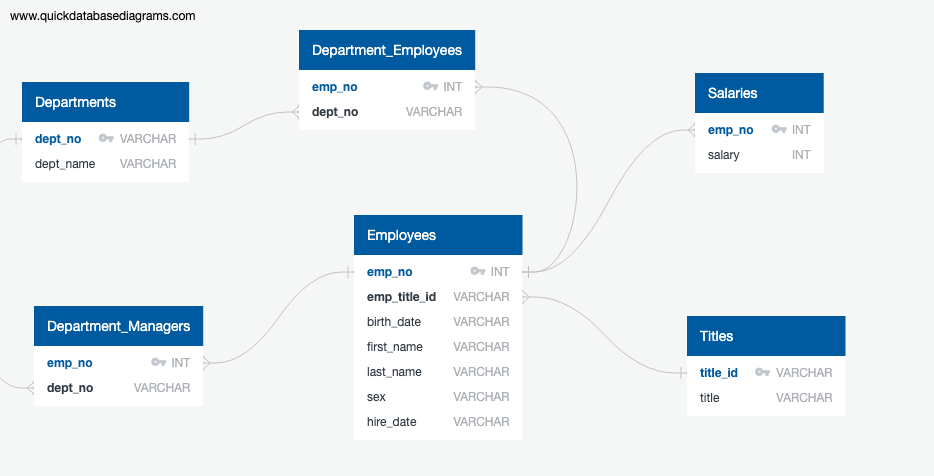

## **SQL-Homework**

The SQL challenge consisted of three parts to analyze a company's old emplopyee data: 

---

#### **Data Modeling**
The first part was to map out and model the data using an Entity Relationship Diagram. QuickDBD was used to produce the finished product:

---

#### **Data Engineering**
In the next part, tables were created and populated with the provided csv files. A total of six cvs files were imported and read into six different tables: Employees, Departments, Department Managers, Department Employees, Salaries, and Titles. 

---

#### **Data Analysis**

In the final component of the challenge, which dealt with data analysis, different columns of interest were extracted from the data tables to give insights into the companies employee structure. 